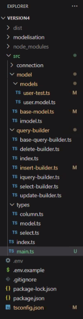

# Structure du projet

Notre dossier `src` situé à la racine du projet contiendra 4 dossiers:
- `connection`,
- `models`,
- `query_builders`,
- `types` 

Voici un exemple:  


# Project Setup

- Node.js et npm étaient déjà installés sur ma machine Fedora Linux
- J'ai installé XAMPP 
  - X = Cross-platform 
  - A = Apache 
  - M = MySQL 
  - P = PHP
  - P = Perl
- Pour lancer les services XAMPP: `sudo /opt/lampp/lampp start`
  - j'ai créé un alias dans mon ~/.zshrc = `xampp`
- Pour gérer les BDD, ouvrir un navigateur Web et aller sur http://localhost/phpmyadmin/
- création d'une nouvelle BDD nommée 'ORM'
- création d'un fichier `.gitignore` pour exclure certains fichiers de la gestion de version Git 
- installation du package **dotenv** via `npm i dotenv` 
  - pour gérer nos variables d'environnement et les charger depuis un fichier `.env`
- création d'un fichier `.env` à la racine du projet pour y déclarer la variable de connection à notre BDD
- installation du package **mysql2** via `npm i mysql2`
  - pour autoriser notre programme à se connecter à notre BDD MySQL et à interagir avec elle
- installation des dev depencies pour TypeScript: `npm i -D typescript @types/node`
- installation du package tsx: `npm i -D tsx`
  - pour exécuter des fichiers TypeScript sans compilation manuelle préalable
- ajout d'un script à mon `package.json` pour pouvoir exécuter mon code TypeScript via `npm start`
```json
"scripts": {
  "start": "tsx ./src/main.ts"
}
```
- Initialisation du fichier de config tsconfig.json via `npx tsc --init`
- modification de tsconfig.json pour: 
  - indiquer le dossier où placer les fichiers générés par le compilateur TypeScript 
  - inclure tous les fichiers compris dans le dossier `src` et ses sous-dossiers
  - exclure les dépendances et les fichiers générés automatiquement
```json
{
  "compilerOptions": {
    "outDir": "./dist",
    // ......
  },
  "include": ["src/**/*"],
  "exclude": ["node_modules", "dist"]
}
```

# TODO du 2 juillet

- [x] Utiliser `create_tables.sql` pour créer les tables 'user' et 'post' dans notre BDD
  - la création des futures tables se fera via la fonctionnalité "Migrations" qu'on implémentera par la suite
- [x] côte TypeScript, implémenter 2 classes: 
  - [x] BaseQueryBuilder 
  - [x] InsertQueryBuilder
- [x] instancier la classe InsertQueryBuilder depuis un `main.ts` 
- [x] le `main.ts` contiendra aussi un `console.log` des requêtes générées
- [x] exécuter le SQL généré dans un soft dédié (PHPmyAdmin) pour tester la validité de la requête

# TODO du 3 juillet

- [ ] Coder le code de connection
- [ ] implémenter la connection dans BaseModel
- [ ] Utiliser la fonction create de BaseModel (ou de sa classe fille) pour insérer un user dans la DB
- [ ] Construire la classe SelectQueryBuilder
- [ ] utiliser la fonction find pour trouver un User selon un filtre

# Preventing SQL injection with Parameterization

src = https://www.perplexity.ai/search/what-are-sql-parameters-can-yo-fLKOAMedSuaLGpckBfDh7A  

We should handle SQL parameters separately from our query string.  
My current `buildQuery(): string` method encourages building a single string with values directly embedded,  
which is a major security risk for SQL injection.  

A much safer approach is to have `buildQuery` return an **object** containing the SQL query with placeholders (? or $1, $2, etc.),  
and a separate array of values.  

This allows us to use prepared statements (or parameterized queries) in our database driver, which is the standard way to prevent SQL injection.

## What are SQL Parameters?

SQL parameters are placeholders or variables used within SQL statements to represent values that will be supplied at execution time,  
rather than hardcoding those values directly into the query.   

This allows us to write SQL queries that can be reused with different data inputs, increasing flexibility and security.   
Parameters are typically represented as question marks (?) for unnamed parameters, or with a prefix like :name or @name for named parameters,  
depending on the database system.

## How parameterization prevents SQL injection?

SQL injection occurs when untrusted user input is concatenated directly into SQL statements, allowing attackers to manipulate the query  
and potentially execute malicious SQL code.  

Parameterized queries (also called **prepared statements**) prevent this by separating SQL code from data:   
the SQL statement is defined with placeholders, and **user input** is supplied as **parameters**, not as part of the SQL string.  

The database engine treats parameter values strictly as data, not as executable code, regardless of their content.  
This means that even if a user tries to inject SQL code via a parameter, it will not be executed, but rather treated as a literal value.