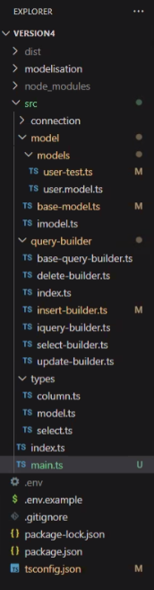

# Structure du projet

Notre dossier `src` situé à la racine du projet contiendra 4 dossiers:
- `connection`,
- `data_models`,
- `query_builders`,
- `types` 

Voici un exemple:  

# Project Setup

- J'ai installé XAMPP sur ma machine fedora Linux (XAMPP 
  - X = Cross-platform 
  - A = Apache 
  - M = MySQL 
  - P = PHP
  - P = Perl
- Pour lancer les services XAMPP: `sudo /opt/lampp/lampp start`

# TODO

- Utiliser `create_tables.sql` pour créer les tables 'user' et 'post' dans notre BDD 
  - la création des futures tables se fera via la fonctionnalité "Migrations" qu'on implémentera par la suite
- côte TypeScript, implémenter 2 classes: BaseQueryBuilder et InsertQueryBuilder
- instancier la classe Insert depuis un main.ts et console.log des requêtes générées
- exécuter le SQL généré dans un soft dédié (PHPmyAdmin)
- Construire SelectQueryBuilder

